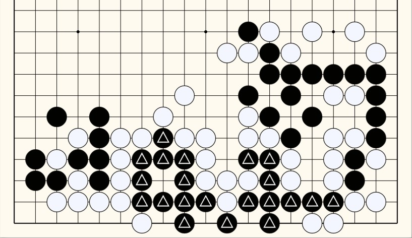
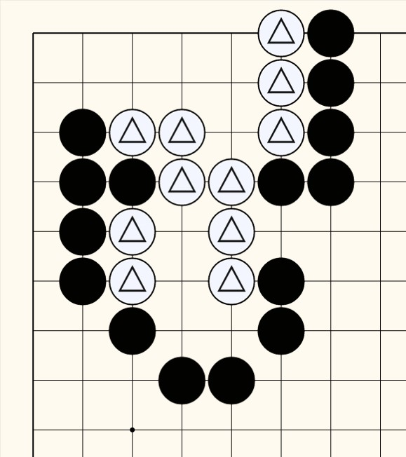
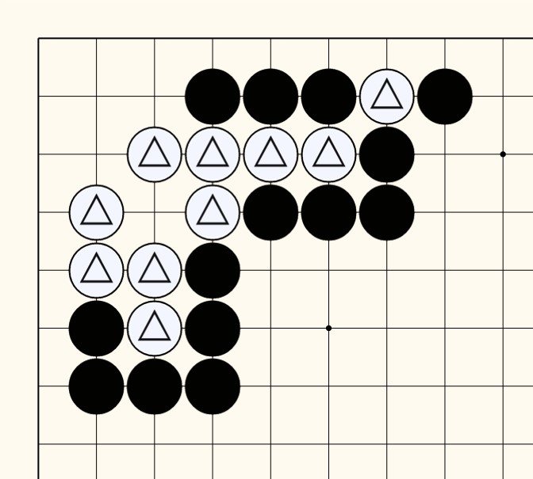
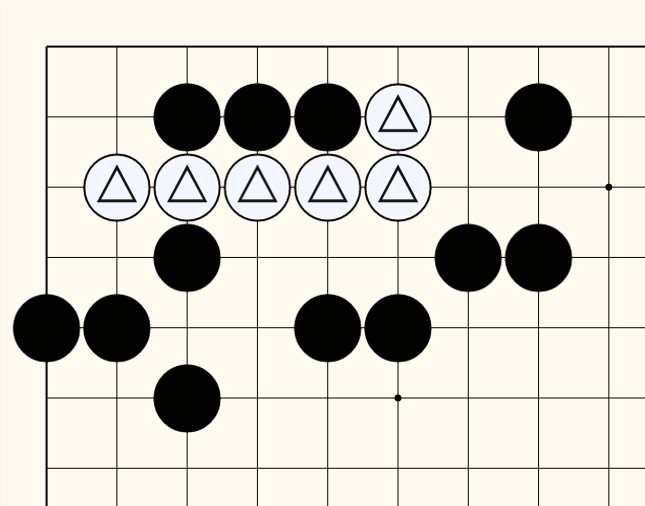
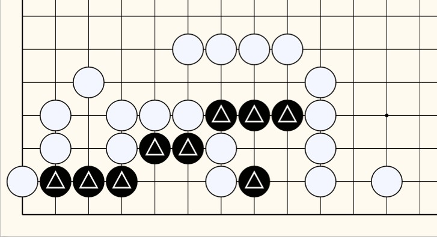
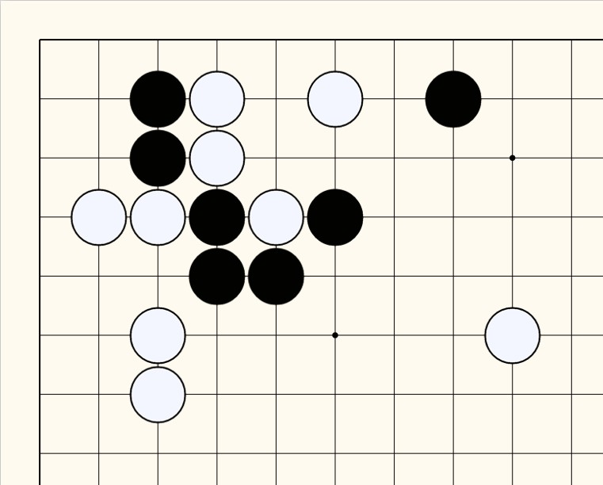
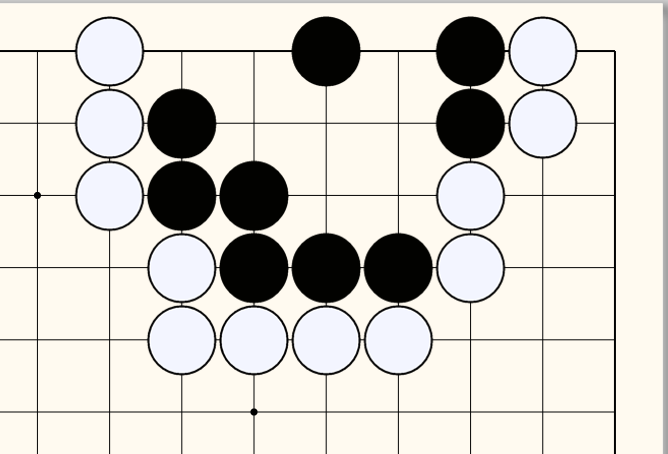

26 - 012625 Find the best move for black
|                     |                         |                         
|:-------------------:|:------------------------|
|[ Click to download game file](https://wildcard-theboard.github.io/Pan-TheBoard/GameFiles/GoPuzzles/GameReview011225.gbf)|Amazing game reading by professionals.  The marked balck stones are about to be captured and the player has to find a move for best.   1. The game file has 2 parts. The first is the overall game sequence and the second is Scenario format for your exercise.  2. The file is unlocked. You may add or change as you wish.  Reference: Game Review 011225 |

26 - 011925
|                     |                         |                         
|:-------------------:|:------------------------|
|[ Click to download game file](https://wildcard-theboard.github.io/Pan-TheBoard/GameFiles/GoPuzzles/GoPuzzle_424.gbf)|Capture the white stones. Avoid Ko or stalemate.  The file is unlocked. You may add or change as you wish.  Reference: Go Puzzle #424 |

25 - 011325
|                     |                         |                         
|:-------------------:|:------------------------|
|[ Click to download game file](https://wildcard-theboard.github.io/Pan-TheBoard/GameFiles/GoPuzzles/GoPuzzle_423.gbf)|Capture the white stones. Avoid Ko.  The file is unlocked. You may add or change as you wish.  Reference: Go Puzzle #423 |

24 - 010525
|                     |                         |                         
|:-------------------:|:------------------------|
|[ Click to download game file](https://wildcard-theboard.github.io/Pan-TheBoard/GameFiles/GoPuzzles/GoPuzzle_420.gbf)|Capture the white stones. Avoid Ko.  The file is unlocked. You may add or change as you wish.  Reference: Go Puzzle #420 |

23 - 122924
|                     |                         |                         
|:-------------------:|:------------------------|
|[ Click to download game file](https://wildcard-theboard.github.io/Pan-TheBoard/GameFiles/GoPuzzles/Life_and_Death_419.gbf)|Capture all the white stones.  The file is unlocked. You may add or change as you wish.  Reference: Life and Death #409 |

22 - 122324
|                     |                         |                         
|:-------------------:|:------------------------|
|[ Click to download game file](https://wildcard-theboard.github.io/Pan-TheBoard/GameFiles/GoPuzzles/GoPuzzle_121124.gbf)|Save all black stones by moving first.  The file is unlocked. You may add or change as you wish.  Reference: Go puzzle Ex. 121124 |

21 - 121124
|                     |                         |                         
|:-------------------:|:------------------------|
|[ Click to download game file](https://wildcard-theboard.github.io/Pan-TheBoard/GameFiles/GoPuzzles/GoPuzzle_405.gbf)|Capture the white stones by black moving first.  The file is unlock. You may add or change as you wish.  Reference: Life and Death #405 |

20 - 120924
|                     |                         |                         
|:-------------------:|:------------------------|
|[ Click to download game file](https://wildcard-theboard.github.io/Pan-TheBoard/GameFiles/GoPuzzles/Go_puzzle_Ex_120224.gbf)|Capture the white stones by black moving first.  The file is unlock. You may add or change as you wish.  Reference: Go puzzle Ex. 120224 |

19 - 120124
|                     |                         |                         
|:-------------------:|:------------------------|
|[ Click to download game file](https://wildcard-theboard.github.io/Pan-TheBoard/GameFiles/GoPuzzles/GoPuzzleExample1.gbf)|Save black stones by moving first.  Reference: GoPuzzleExample1 |

18 - 112524
|                     |                         |                         
|:-------------------:|:------------------------|
|[ Click to download game file](https://wildcard-theboard.github.io/Pan-TheBoard/GameFiles/071Tsmego500.gbf)|Save black stones by moving first.  Reference: 071Tsmego500 |

17 - 111824
|                     |                         |                         
|:-------------------:|:------------------------|
|[ Click to download game file]()|Save black stones by Ko.  Reference: Life and Death Ex.50 |

16 - 111124
|                     |                         |                         
|:-------------------:|:------------------------|
|[ Click to download game file](https://drive.google.com/file/d/16hP8wraf96m64TcfbfBi2KJYq1Y3w5OS/view?usp=sharing)|Save black stones and capture the marked white stone.  Reference: Life and Death Ex.49 |

15 - 110424
|                     |                         |                         
|:-------------------:|:------------------------|
|[ Click to download game file](https://drive.google.com/file/d/16qxu9lYF5w6D-ZWm9XQR7aWpX8Bgp3TU/view?usp=sharing)|Save black stones and capture the marked white stone.  Reference: Life and Death Ex.48 |

14 - 102724
|                     |                         |                         
|:-------------------:|:------------------------|
|[ Click to download game file](https://drive.google.com/file/d/16rAvBu5dQvKkYUMGk-PwWSaRtZFgYzsj/view?usp=sharing)|Save black stones.  Reference: Life and Death Ex.47 |

13 - 102124
|                     |                         |                         
|:-------------------:|:------------------------|
|[ Click to download game file](https://drive.google.com/file/d/16rCMaWneeuIKpTfgqXFItpfqGkLobsz8/view?usp=sharing)|Capture the marked white stones.  Reference: Life and Death Ex.46 |

12 - 101424
|                     |                         |                         
|:-------------------:|:------------------------|
|[ Click to download game file](https://drive.google.com/file/d/16sastkK5CaZzNgJTf9k7bhzFqDQi2rbd/view?usp=sharing)|Save marked black stones.  Reference: Life and Death Ex.45 |

11 - 100724
|                     |                         |                         
|:-------------------:|:------------------------|
|[ Click to download game file](https://drive.google.com/file/d/16wOGeaF-Xo2c6jdobxaDTz9g35rkDviy/view?usp=sharing)|Capture the white stones.  Reference: Life and Death Ex.44 |

10 - 093024
|                     |                         |                         
|:-------------------:|:------------------------|
|[ Click to download game file](https://drive.google.com/file/d/170vB6GMSShGNyXqxJCnmt1BgtRV39w6i/view?usp=sharing)|Capture the marked white stones.  Reference: Life and Death Ex.43|

9 - 092324
|                     |                         |                         
|:-------------------:|:------------------------|
|[ Click to download game file](https://drive.google.com/file/d/178fGAIlFQphhezOUOSWwgjiH9Vz1EWfm/view?usp=sharing)|Capture the marked white stones.  Reference: Life and Death Ex.42|

8 - 091524
|                     |                         |                         
|:-------------------:|:------------------------|
| [ Click to download game file](https://drive.google.com/file/d/17FH0mCBgVuSAsZoFwvfdb814KOj9Yghx/view?usp=sharing) |Capture the white stones.  Reference: Life and Death Ex.41|

7 - 090824
|                     |                         |                         
|:-------------------:|:------------------------|
| [ Click to download game file](https://drive.google.com/file/d/17FrvsMskziz8XjVldptB2rCtQzmzKQxY/view?usp=sharing)| Save black stones.  Reference: Life and Death Ex.40  |

6 - 090224
|                     |                         |                         
|:-------------------:|:------------------------|
| [ Click to download game file](https://drive.google.com/file/d/17LvBULlBlGPLf88NJFN7_KXI_DonK2TT/view?usp=sharing) | Move black first and capture all white stones.  Reference: Life and Death Ex.39  |

5 - 082524
|                     |                         |                         
|:-------------------:|:------------------------|
| [ Click to download game file](https://drive.google.com/file/d/17Tk30EVzkuvLPOqnY-6CyZqH-66TdRps/view?usp=sharing) | Save black stones by moving first.  Reference: Life and Death Ex.38  |

4 - 081924
|                     |                         |                         
|:-------------------:|:------------------------|
| [ Click to download game file](https://drive.google.com/file/d/17U1N7Ww83xmvXsXHZefNQQa042GAr_Bm/view?usp=sharing) | Move black first and capture the white stones.  Reference: Life and Death Ex.37  |

3 - 081124
|                     |                         |                         
|:-------------------:|:------------------------|
|  | Move black first and save it. To be alive/stable, black must have 2-seperate-unbreakable-eyes.  Click the figure to download Go file.  Reference: Life and Death Ex.36  |

2 - 080524
|                     |                         |                         
|:-------------------:|:------------------------|
|  | Move black first and capture the white stones at the corner.  Click the figure to download Go file.  Reference: Life and Death Ex.33  |

1 - 072824
|                     |                         |                         
|:-------------------:|:------------------------|
|  | Move black first and capture the white stones.  Click the figure to download Go file.  Reference: Life and Death Ex.34  |
