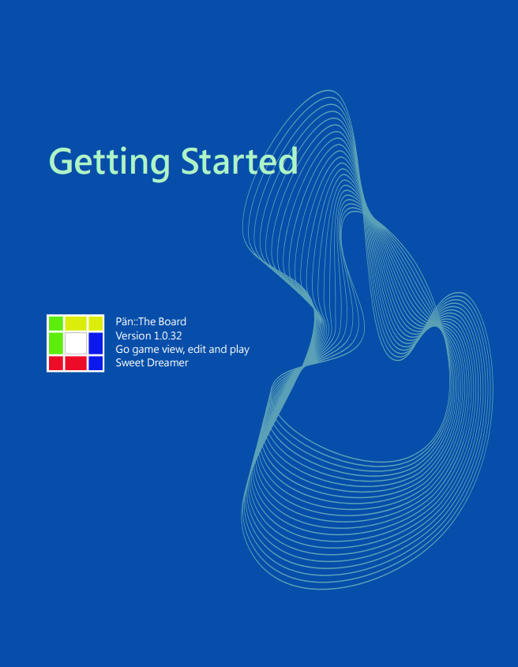

### User's manual and sample files

|                     |                     |          
|:-------------------:|:-------------------:|
| [ Click to download PDF file](https://wildcard-theboard.github.io/Pan-TheBoard/Manual/Document/TheBoard-GettingStarted.pdf)|Sample file for manual :  <a href="https://wildcard-theboard.github.io/Pan-TheBoard/Manual/Document/Getting Started.gbf">Getting Started.gbf</a> |        

  
#### * Known issue under review

|                       |                         |
|:----------------------|:------------------------|
| Game tree view | Sometimes, the display in GoInfoViewer is mixed up the information with title and the stone moves. The issue is still under the review and investigation. When user has this issue,please turn it off and on. The game tree is refreshed and displays the information properly. |

