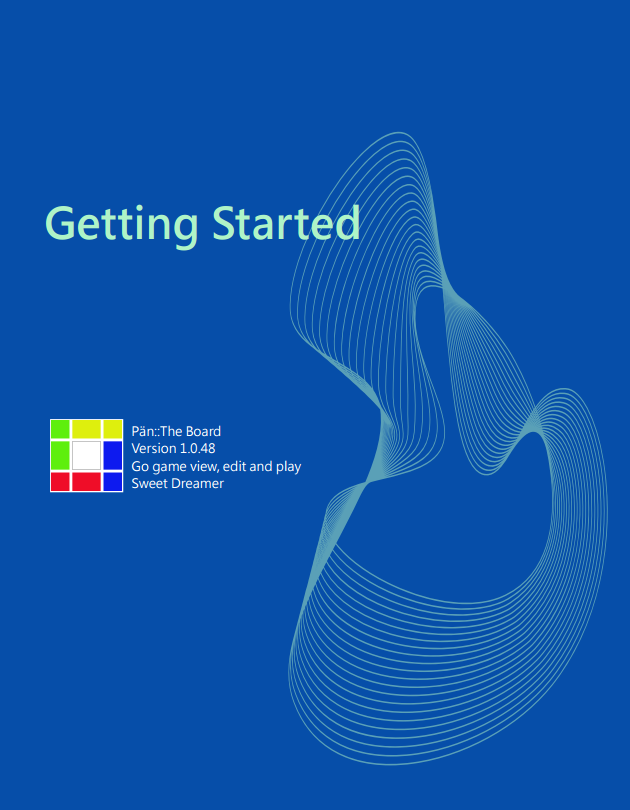

### User's manual and sample files

|                     |                     |          
|:-------------------:|:-------------------:|
| [ Click to download PDF file](https://wildcard-theboard.github.io/Pan-TheBoard/Manual/Document/GettingStarted-1.0.48.r0.pdf)|Sample file for manual :  <a href="https://wildcard-theboard.github.io/Pan-TheBoard/Manual/Document/Getting Started.gbf">Getting Started.gbf</a> |        

  
#### * Known issue under review

|                       |                         |
|:----------------------|:------------------------|
| Game tree view | There were some tries of its performance improvement. Wrong symbol could be displayed on game title yet, but it should be OK in use as it does not affect on the information structure. |

