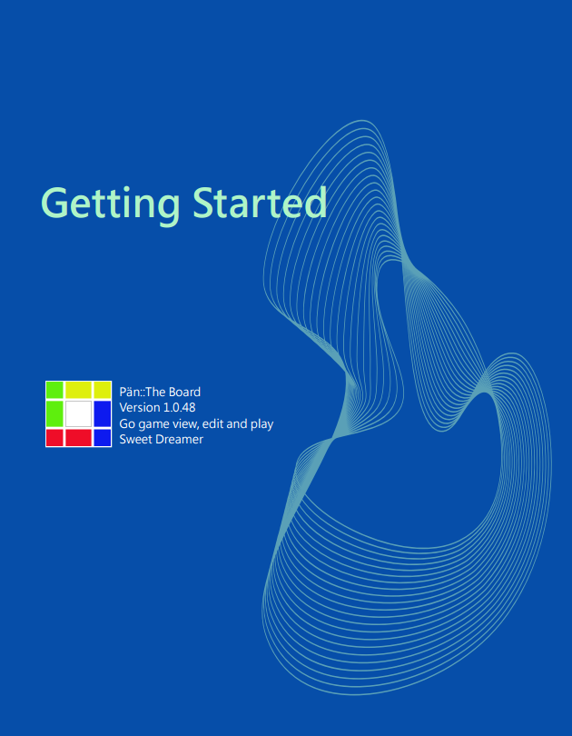

### User's manual and sample files

|                     |                     |          
|:-------------------:|:-------------------:|
| [ Click to download PDF file](https://wildcard-theboard.github.io/Pan-TheBoard/Manual/Document/GettingStarted-1.0.48.r0.pdf)|Sample file for manual :  <a href="https://wildcard-theboard.github.io/Pan-TheBoard/Manual/Document/Getting Started.gbf">Getting Started.gbf</a> |        

  
#### KataGo Installation Recommanded

|                    |         
|:-------------------|
|Many functions, especially analysis related, of this app rely on Go Engine's performance. To do so, the app has equipped GNU Go and Leela Zero as default, and KataGo can be interfaced as described in the manual. Among the available Go Engines, KataGo is considered the best in speed and accuracy, and recommanded to run with the app.| 

  
#### * Known issue under review

|                       |                         |
|:----------------------|:------------------------|
| Game tree view | There were some tries of its performance improvement. Wrong symbol could be displayed on game title yet, but it should be OK in use as it does not affect on the information structure. |

