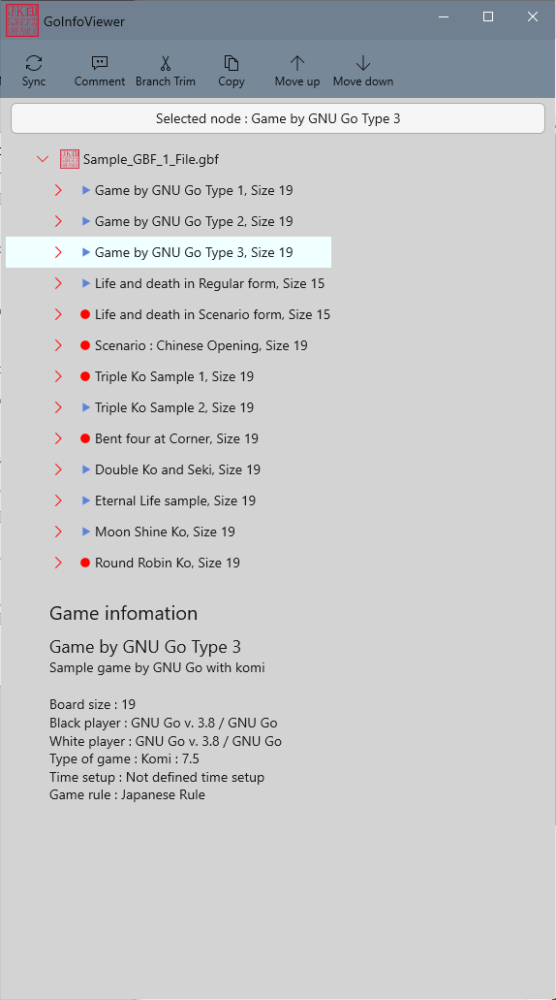

### Game Tree and Management
Click 'InfoView' icon  from the status bar of the app. It will open a seperate windows on the right side shown as below:

|            |                   |  
|:-----------|:------------------|
| |The window shows menu icons on the top. In the middle, the file name and the game titles are listed, and , at the bottom, selected game information is displayed.  |   
| | As shown, the information section has the file name on the top and the game titles are attached below. This is similar look of branch on a tree and called game tree.  This marker means it is 'Regular' game tree.  This marker means it is 'Scenario' game tree.|
| |Click the arrow '>' at the left of a game tree. Again, it shows the stone information with number, stone color and its coordinate on the board. Again, this is a part of game tree.  | 
| | The menu bar on the top provides tools to manage the game tree as below:   'Sync' - Select a branch and click 'Sync'. The game tree is displayed on the board.  'Comment' - Selecte a branch and click 'Comment'. It opens an edit box to add or revise the existing comment on the selected branch. 'Branch Trim' - This removes a selected game tree and its sub-branch. 'Copy' - This creates a copy of a selected game tree and add it at the end of the tree.  'Move up' and 'Move down' - It moves up or down a selected game tree.  * The menum items are activated based on the selected game tree.  * The game tree may not be properly displayed when working on it. This is still under review. In case you have, just turn it off and on again, then the tree is properly displayed |

[Back to Contents](BoardCtrl-Contents.md)
