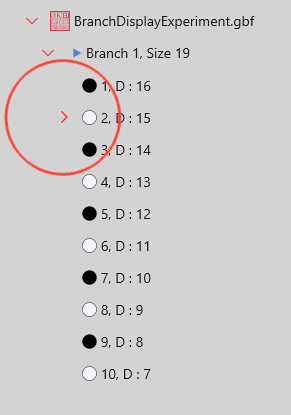
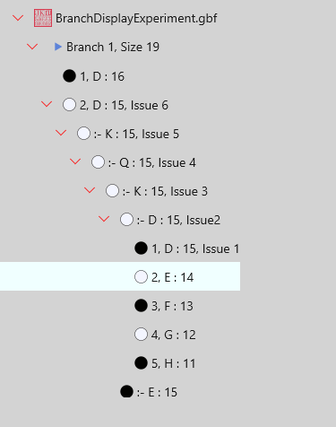

[Back to Contents](BoardCtrl-Contents.md)&nbsp; &nbsp; &nbsp;[< Prev](BoardCtrl-GameTree.md)&nbsp; &nbsp; &nbsp;[Next >](BoardCtrl-Scenario.md)
### Traverse between Game Tree
Assumed the app, Pän::The Board, is installed and turned on.
Download and open a branch sample file, [BranchDisplayExperiment.gbf](SampleFiles/BranchDisplayExperiment.gbf).  
The file is created just to explain how stone moves are attached on game tree.

|            |                   |  
|:-----------|:------------------|
| |This shows the board when the sample file is opened. This is main game tree with 10 stones. The main tree has 'cyan color tag' on the last stone, #10, as shwon.  |   
| | Open game tree InfoView by select  from status bar. Click the chevron from the file and game header as shown. You can see a chevron again added on the stone #2. This means there is another 'sister' game tree at the stone #2. Click all the down headed chevron and make them all right headed as shown below.  |
| |From the InfoViewer, You can see that stone #2 on main tree has 5 more 'sister' trees.   Select anywhere on the last game tree of commented 'Issue 1', and click 'Sync' from the menu bar of InfoViewer.|   
| |See the board that shows the selected game tree.  The original stone at D16 does not show the stone number because it is the main game tree, and also it cannot be editable for color change or drag. Stone number start from newly added game tree as shown, and the last stone. #5, has 'red color tag' that means displayed game tree is Sub-Branch.  You may select any of game tree from the InfoViewer and see the attached stone layout on the the board. Even you can go back to the original main game tree from here.  |   
| |When a sub-branch is displayed, the board has an additional traverse button as shwon below:   This is a button to go back to main branch. Click it, and the board shows the stone of the main branch that was the top of the sub-branch. If required, you can traverse the main branch from here.   |   

[Back to Contents](BoardCtrl-Contents.md)&nbsp; &nbsp; &nbsp;[< Prev](BoardCtrl-GameTree.md)&nbsp; &nbsp; &nbsp;[Next >](BoardCtrl-Scenario.md)

