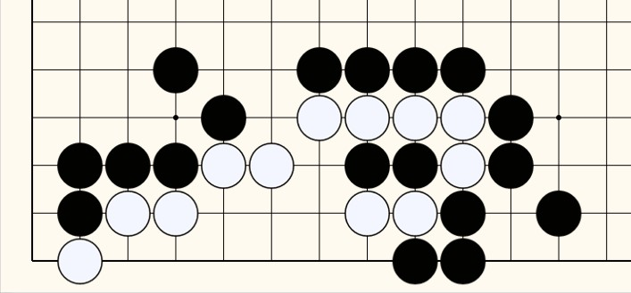

### Capture the white stones

|                     |                         |                         
|:-------------------:|:------------------------|
|[ Click to download game file](https://wildcard-theboard.github.io/Pan-TheBoard/GameFiles/GoPuzzles/GoPuzzle_010725.gbf)|Capture the white stones. Avoid Ko or stalemate.  The file is unlocked. You may add or change as you wish.  Reference: Go Puzzle 010725 |

|                     |                             
|:-------------------:|
| [Now Live! @OGS](https://online-go.com/)  _Watch games, and learn..._ |

|                     |                             
|:-------------------:|
|     |

  

### Watch and Play 
<small>Find more at</small> [_Game page 1_](GameFiles/GameList1.md), [_Game page 2_](GameFiles/GameList2.md).. 

|Title                |Video                     |Game type                 |File type               |Language             |Remarks              |
|:-------------------:|:------------------------:|:------------------------:|:----------------------:|:-------------------:|:-------------------:|
|Go Puzzle 010725 ||Life and Death/Puzzle    |<a href="https://wildcard-theboard.github.io/Pan-TheBoard/GameFiles/GoPuzzles/GoPuzzle_010725.gbf">GBF/Go puzzle</a> |Korean |Editable            |
|Go Puzzle 010525 ||Life and Death/Puzzle    |<a href="https://wildcard-theboard.github.io/Pan-TheBoard/GameFiles/GoPuzzles/GoPuzzle_010525.gbf">GBF/Go puzzle</a> |Korean |Editable            |
|Go Puzzle 010425 ||Life and Death/Puzzle    |<a href="https://wildcard-theboard.github.io/Pan-TheBoard/GameFiles/GoPuzzles/GoPuzzle_010425.gbf">GBF/Go puzzle</a> |Korean |Editable            |
|Go Puzzle 122624 ||Life and Death/Puzzle    |<a href="https://wildcard-theboard.github.io/Pan-TheBoard/GameFiles/GoPuzzles/GoPuzzle_122624.gbf">GBF/Go puzzle</a> |Korean |Editable            |
|Go Puzzle 123124 ||Life and Death/Puzzle    |<a href="https://wildcard-theboard.github.io/Pan-TheBoard/GameFiles/GoPuzzles/GoPuzzle_123124.gbf">GBF/Go puzzle</a> |Korean |Editable            |
|Go Puzzle 123024 ||Life and Death/Puzzle    |<a href="https://wildcard-theboard.github.io/Pan-TheBoard/GameFiles/GoPuzzles/GoPuzzle_123024.gbf">GBF/Go puzzle</a> |Korean |Editable            |
|Game Review 011225 ||Game Review and Higlight    |<a href="https://wildcard-theboard.github.io/Pan-TheBoard/GameFiles/GoPuzzles/GameReview011225.gbf">GBF/Scenario</a> |Korean |2 parts of overview and scenario for exercise       |
|Go Puzzle #424 ||Life and Death/Puzzle    |<a href="https://wildcard-theboard.github.io/Pan-TheBoard/GameFiles/GoPuzzles/GoPuzzle_424.gbf">GBF/Go puzzle</a> |Korean |Editable            |
|Go Puzzle #423 ||Life and Death/Puzzle    |<a href="https://wildcard-theboard.github.io/Pan-TheBoard/GameFiles/GoPuzzles/GoPuzzle_423.gbf">GBF/Go puzzle</a> |Korean |Editable            |
|Handling of 3-3 invasion ||Review of game opening |<a href="https://wildcard-theboard.github.io/Pan-TheBoard/GameFiles/GoPuzzles/Handling of 3-3 invasion.gbf">GBF</a> |English |2 parts of background and handling scenario at 3-3 |
|Go Puzzle #420 ||Life and Death/Puzzle    |<a href="https://wildcard-theboard.github.io/Pan-TheBoard/GameFiles/GoPuzzles/GoPuzzle_420.gbf">GBF/Go puzzle</a> |Korean |Editable            |
|Initial 50 moves 122424||Game review    |<a href="https://wildcard-theboard.github.io/Pan-TheBoard/GameFiles/GoPuzzles/Initial 50 moves -122424.gbf">GBF</a> |Korean | Beginner's common mistake at game opening  |
|Life and Death #409 ||Life and Death/Puzzle    |<a href="https://wildcard-theboard.github.io/Pan-TheBoard/GameFiles/GoPuzzles/Life_and_Death_419.gbf">GBF/Go puzzle</a> |Korean |Editable            |
|Samsung Go Masters 1997-1  ||Game review    |<a href="https://wildcard-theboard.github.io/Pan-TheBoard/GameFiles/GoPuzzles/Samsung Go Masters 1997-1.gbf">GBF</a> |Korean | Lee Changho vs Naoto Hikosaka       |
|Go puzzle Ex. 121124 ||Life and Death/Puzzle    |<a href="https://wildcard-theboard.github.io/Pan-TheBoard/GameFiles/GoPuzzles/GoPuzzle_121124.gbf">GBF/Go puzzle</a> |Korean |Li He vs. Choi Jeong            |
|Life and Death #405 ||Life and Death/Puzzle    |<a href="https://wildcard-theboard.github.io/Pan-TheBoard/GameFiles/GoPuzzles/GoPuzzle_405.gbf">GBF/Go puzzle</a> |Korean |Editable            |
|7th Wu Qingyuan Cup Final 3rd Round  ||Game review    |<a href="https://wildcard-theboard.github.io/Pan-TheBoard/GameFiles/GoPuzzles/7th_Wu_Qingyuan_Cup_Final_3rd_Round.gbf">GBF</a> |Japanese |            |
|Go puzzle Ex. 120224 ||Life and Death/Puzzle    |<a href="https://wildcard-theboard.github.io/Pan-TheBoard/GameFiles/GoPuzzles/Go_puzzle_Ex_120224.gbf">GBF/Go puzzle</a> |Korean |Editable            |
|Life and Death Ex.23  ||Life and Death    |<a href="https://wildcard-theboard.github.io/Pan-TheBoard/GameFiles/Life and Death Ex. 23.gbf">GBF</a> |Korean |-             |
|GoPuzzleExample1 ||Life and Death    |<a href="https://wildcard-theboard.github.io/Pan-TheBoard/GameFiles/GoPuzzles/GoPuzzleExample1.gbf">GBF/Go puzzle</a> |Korean | -            |
|Life and Death Ex.22  ||Life and Death    |<a href="https://wildcard-theboard.github.io/Pan-TheBoard/GameFiles/Life and Death Ex. 22.gbf">GBF</a> |Korean |-             |
|071Tsmego500 ||Life and Death    |<a href="https://wildcard-theboard.github.io/Pan-TheBoard/GameFiles/071Tsmego500.gbf">GBF/Go puzzle</a> |Japanese | -            |
|Life and Death Ex.21  ||Life and Death    |<a href="https://wildcard-theboard.github.io/Pan-TheBoard/GameFiles/Life and Death Ex. 21.gbf">GBF</a> |Korean |-             |
|Life and Death Ex.50 ||Life and Death    |<a href="https://drive.google.com/file/d/16eiS5UBA_ytmFNh3FQQZzwHM9CXjXfqO/view?usp=sharing">GBF</a> |Korean |             |
|Samsung World Go Masters 2024.8.31  ||Game review    |<a href="https://drive.google.com/file/d/18O0aXTC80DoVMw_fxz8WGXM8bX7P2DHn/view?usp=sharing">GBF</a> |Korean |Li He vs. Choi Jeong           |
|Joseki after Joseki - 12  ||Joseki review    |<a href="https://drive.google.com/file/d/18-kMa9hBNQKKjLROK6__d44qtqo-PLG6/view?usp=sharing">GBF</a> |English |Case study of 3-3 invasion            |

